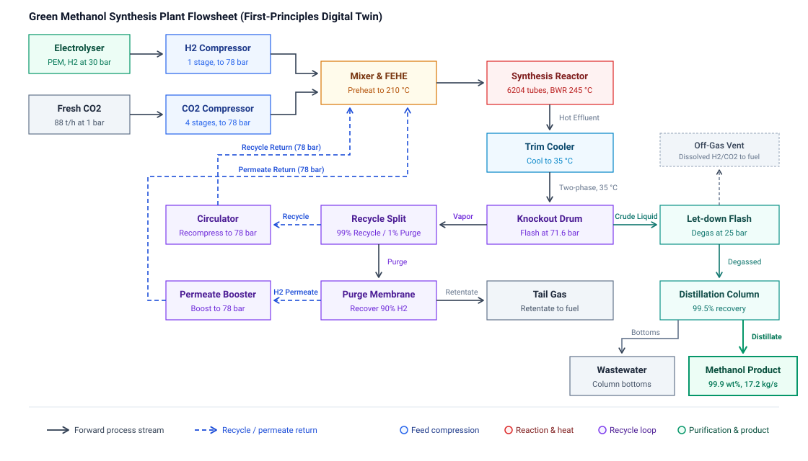

# Problem formulation

The machine learning layer learns two functions from the compiled green methanol twin. The surrogate model is a regression map that emulates the twin scalar design-point response in microseconds. The feasibility classifier predicts whether a flowsheet design solves and identifies the termination outcome code. Both models train on a unified dataset generated by sampling the twin parameter space. Feasible design points train the regression surrogate, while the complete dataset trains the feasibility classifier.

The C++ twin provides the evaluation truth. Each dataset and model record includes a fingerprint tying the artifact to the specific twin binary build.

## Architecture

The overall plant flowsheet modeled by the digital twin is illustrated in Figure 1.



Figure 1: Flowsheet architecture of the green methanol synthesis digital twin. The plant couples fresh carbon dioxide and hydrogen feed compression, multi-stream recuperative heat exchangers, a fixed-bed cooled shell-and-tube reactor with copper/zinc-oxide catalyst, high-pressure liquid-gas flash separation, and an unreacted syngas recycle loop with purge fraction control.

As depicted in the flowsheet, fresh feed enters through multi-stage compressors, combines with pressurized recycle gas, and preheats against hot reactor effluent before entering the catalyst bed. The cooled tubular reactor executes the coupled kinetics of methanol synthesis and water-gas shift. Effluent drops into a high-pressure flash unit where raw methanol and water condense as liquid product, while the non-condensed vapor splits into a purge stream and a recycle stream driven by a centrifugal circulator.

The machine learning architecture connects directly to this flowsheet through the interface pipeline:

digital_twin (C++) -> generate_dataset -> pilot.parquet -> surrogate regression (feasible rows)
                                                       \-> feasibility classifier (all rows)

- `common/`: design space definitions, sampling plans, twin interface, schema, and fingerprint provenance.
- `surrogate/`: gradient boosted regression models per target with gaussian process uncertainty tracking.
- `feasibility/`: calibrated binary classifier and multiclass failure mode classifier.
- `explore.py`: response curves, Sobol sensitivity bars, Pareto frontier, response surfaces, and feasibility maps.
- `run_all.py`: dataset generation, model training, and figure generation in a single workflow.

## Execution

```powershell
python run_all.py --backend pybind --module digital_twin --n 6000 --jobs 8 --out ../runs/<name>
```

The pybind backend invokes the compiled C++ twin. The mock twin executes the pipeline offline without compiled binaries. The `--wide` parameter expands the sampling box beyond normal operating limits to collect failure outcomes. The `--jobs` flag enables multithreaded evaluation across parallel workers.

## Results on 6000-point physical twin dataset

Dataset: 6000 Latin hypercube points, 95.2% feasible (5715 feasible cases, 285 failures).

Surrogate cross-validated $R^2$:

| Target | Cross-validated $R^2$ |
|---|---|
| Unit cost ($\mathrm{USD/t}$) | 0.984 |
| $\mathrm{CO_2}$ conversion | 0.990 |
| Methanol production rate ($\mathrm{kg/s}$) | 0.992 |
| Annual production ($\mathrm{t/yr}$) | 0.992 |
| Total electric power ($\mathrm{MW}$) | 0.994 |

The surrogate approximates the C++ twin within 1 to 2 percent relative error across the validated parameter space.

Feasibility metrics:

- Binary feasibility: out-of-fold ROC-AUC is 0.89. At a tuned decision threshold, it captures 39 percent of infeasible operating points for preliminary design screening.
- Multiclass failure identification: per-mode recall ranges from 0.04 to 0.11 due to class sparsity in physical failure outcomes (15 to 35 failure points per mode). Expanding parameter boundaries increases the failure rate from 4.50 percent to 4.75 percent. Improved resolution requires targeted boundary sampling along the solver stability perimeter.

## Provenance

Each record stores the C++ twin configuration hash. The dataset sidecar preserves parameter bounds, input feature names, target labels, sampling method, and random seed. The serving module checks query hashes against the model provenance before evaluation.
