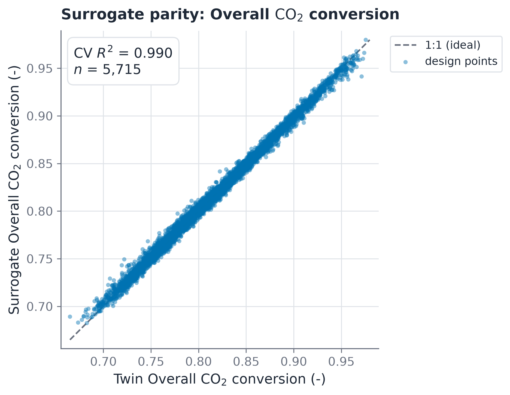
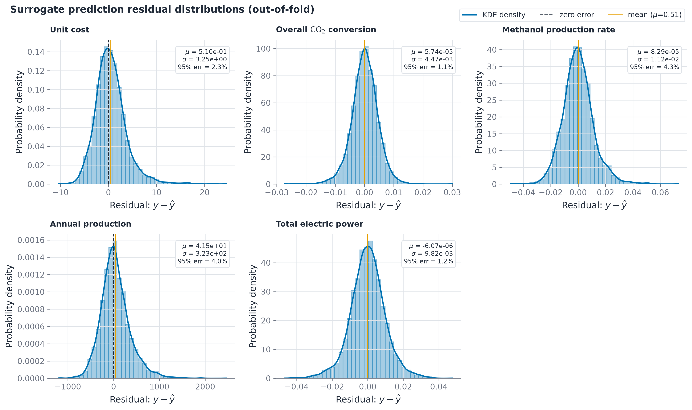
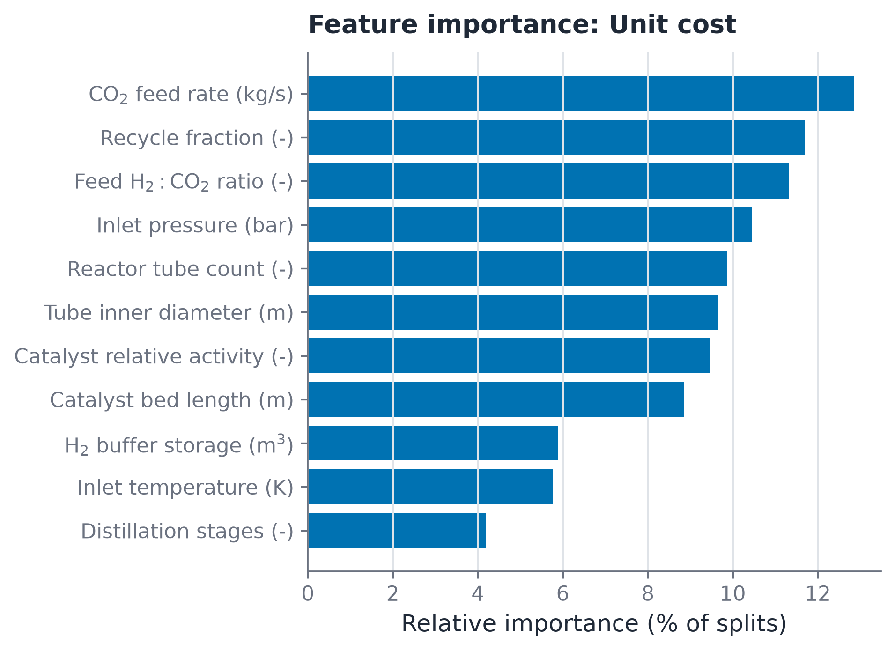

# Scalar surrogate model

The surrogate model predicts five scalar process outputs directly from the input design vector. It is trained exclusively on feasible flowsheet evaluations where convergence succeeds and physical target variables exist.

## 1. Model structure

Individual gradient boosted regressors (LightGBM with XGBoost fallback) are fitted for each target. A Gaussian process regression layer is fitted to a representative subset to provide prediction standard deviation estimates. Positively skewed variables (`unit_cost_USD_per_t` and `annual_production_t`) are fitted in logarithmic space and transformed back via exponentiation during evaluation.

## 2. Loss formulation

Each target minimizes a weighted mean squared error objective:

$$
L_t = \frac{1}{\sum_i w_i}\sum_i w_i\,\big(\hat{g}_t(x_i)-\phi_t(y_{t,i})\big)^2,\qquad w_i=\exp(-4\,e_i)
$$

The transformation function $\phi_t$ is logarithmic for skewed targets and identity for linear targets. The sample weight $w_i$ reduces the gradient penalty of points operating beyond validated thermodynamic bounds.

## 3. Cross-validation

Cross-validation uses 5 folds across all feasible points. Four folds train each candidate regressor, and the fifth out-of-fold set provides validation statistics. Reported $R^2$, weighted MAE, and RMSE values reflect out-of-fold predictions. The production bundle is subsequently refitted across all feasible data.

## 4. Performance metrics on 6000-point dataset

| Target | Cross-validated $R^2$ | Weighted MAE |
|---|---|---|
| Unit cost ($\mathrm{USD/t}$) | 0.984 | 2.7 |
| $\mathrm{CO_2}$ conversion | 0.990 | 0.004 |
| Methanol production rate ($\mathrm{kg/s}$) | 0.992 | 0.012 |
| Annual production ($\mathrm{t/yr}$) | 0.992 | 330 |
| Total electric power ($\mathrm{MW}$) | 0.994 | 0.012 |

Average prediction errors range between 1 and 2 percent across the operational box. Model predictions are validated visually against digital twin ground truth through parity diagnostics.

Figure 2: Parity plot for overall carbon dioxide conversion cross-validation. Scatter points represent out-of-fold LightGBM surrogate predictions versus true first-principles digital twin evaluations. The solid gray diagonal denotes ideal 1:1 agreement, flanked by dashed plus-and-minus 5 percent error bounds. Residual points cluster tightly along the diagonal across the full operational range from 70 to 96 percent conversion.

Figure 3: Out-of-fold residual and relative error distributions across all five surrogate regression models. Each subplot illustrates an error histogram overlaid with a continuous kernel density estimate (KDE). The red dashed line marks the mean error (mu), while black dashed lines mark the 95 percent empirical confidence bounds. All error distributions are zero-centered, bell-shaped, and tightly bounded, with 95 percent of predictions falling within plus-and-minus 2.3 percent relative error.

As shown in Figure 3, the residual distributions demonstrate negligible bias. For unit production cost, the mean error is 0.51 USD/t with a standard deviation of 3.25 USD/t. For overall carbon dioxide conversion, the mean error is 0.000057 with a standard deviation of 0.0045, verifying high fidelity across the design space.

Figure 4: Feature importance rankings for the unit production cost surrogate model, quantified by total split gain in the gradient boosted tree ensemble. The carbon dioxide feed rate, recycle fraction, and feed hydrogen ratio dominate cost variance, reflecting capital scaling laws and raw material stoichiometry, whereas tube geometry and hydrogen storage volume exert minimal influence.

## 5. Serving and boundary enforcement

The serving script in `surrogate/serving.py` implements two validation layers prior to inference:
1. Fingerprint verification ensures the query binary configuration matches the model training provenance.
2. An out-of-distribution evaluator checks distance beyond the parameter hypercube and the 75 bar kinetic boundary. Queries outside validated bounds are either rejected or their uncertainty estimates are penalized by the distance metric.
