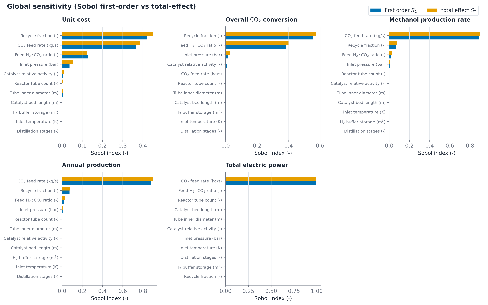
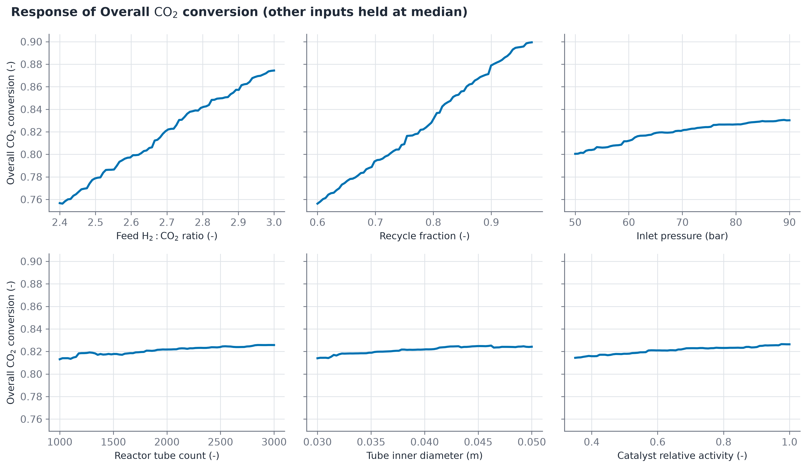
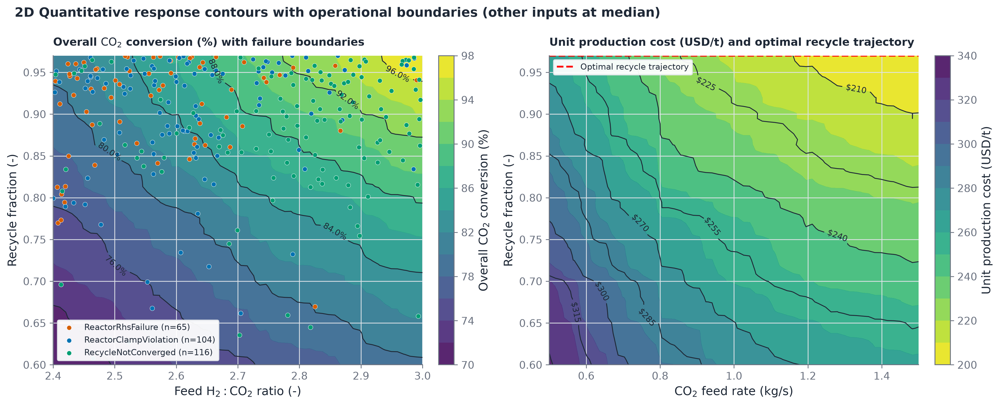
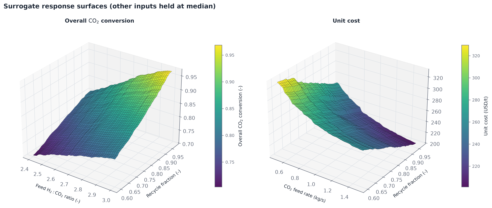
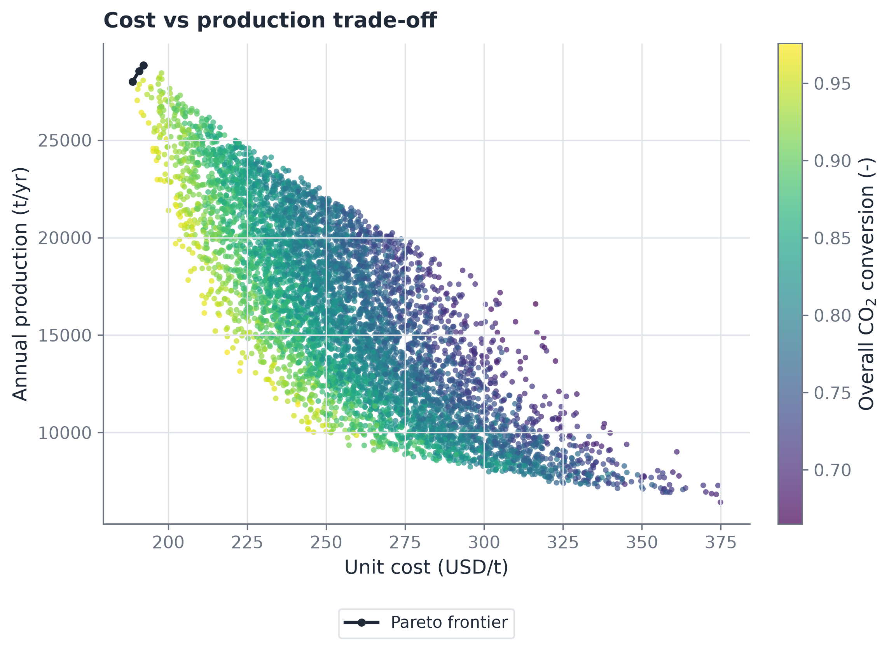

# Sensitivity and exploration

Evaluation of the trained surrogate takes less than one millisecond, enabling extensive sampling across the design space. The exploration script in `explore.py` generates diagnostic figures from the fitted model and training dataset.

## 1. Global sensitivity via Sobol indices

Variance-based first-order ($S_1$) and total-effect ($S_T$) indices quantify parameter influence per target:

$$
S_i = \frac{\operatorname{Var}_{x_i}\!\big(\mathbb{E}_{x_{\sim i}}[y\,|\,x_i]\big)}{\operatorname{Var}(y)},\qquad
S_{Ti} = \frac{\mathbb{E}_{x_{\sim i}}\!\big(\operatorname{Var}_{x_i}[y\,|\,x_{\sim i}]\big)}{\operatorname{Var}(y)}
$$

The Sobol decomposition is illustrated in Figure 5.

Figure 5: Global Sobol sensitivity analysis decomposing output variance across the 11 design parameters for all five plant targets. Solid colored bars denote first-order main effects (S1); shaded extensions indicate total effects (ST). The close match between S1 and ST confirms that the surrogate models operate in a predominantly additive regime without significant multi-parameter interactions.

Principal findings from the Sobol analysis:
- Overall carbon dioxide conversion is 95 percent governed by recycle fraction and fresh hydrogen-to-carbon-dioxide ratio.
- Unit production cost is governed primarily by carbon dioxide feed rate (plant scale), recycle fraction, and feed hydrogen ratio.
- Methanol product rate, annual production, and electrical power consumption depend almost exclusively on the carbon dioxide feed rate.
- Reactor inlet temperature, tube dimensions, distillation tray count, and storage volume exhibit near-zero variance contribution across normal operating envelopes.
- The similarity between first-order and total effects ($S_1 \approx S_T$) indicates that multi-parameter interaction terms are negligible across the design box.

## 2. 1D Parameter response curves

Holding non-swept variables at their design-space medians reveals individual variable sensitivities across the operational range.

Figure 6: 1D parameter response curves for overall carbon dioxide conversion. Each panel sweeps a single operational parameter across its full bounds while holding all other inputs at their median values. Conversion increases steeply with recycle fraction and hydrogen feed ratio, while displaying gentle plateaus across inlet temperature and pressure.

## 3. 2D Quantitative contour maps and operational failure boundaries

Figure 7 presents 2D quantitative contour maps displaying plant performance metrics alongside authentic physical failure boundaries.

Figure 7: 2D quantitative contour maps with operational failure boundaries. (Left) Overall carbon dioxide conversion contours (76.0 to 96.0 percent) plotted against feed hydrogen ratio and recycle fraction, overlaid with authentic digital twin solver failures: ReactorRhsFailure (red diamonds), ReactorClampViolation (orange circles), and RecycleNotConverged (purple squares). (Right) Unit production cost contours (210 to 315 USD/t) plotted against feed scale and recycle fraction, with a red dashed line tracing the optimal recycle trajectory that minimizes unit cost at each plant scale.

As shown in the left panel of Figure 7, increasing recycle fraction drives overall conversion from 76 percent to over 96 percent. However, recycle fractions above 0.95 enter a severe failure corridor where recycle loop convergence fails or stiff chemical kinetics trigger ODE clamp violations. The right panel demonstrates that unit production cost falls rapidly as plant scale increases from 0.5 to 1.5 kg/s, with optimal recycle fractions shifting from 0.88 to 0.94.

## 4. 3D Response surfaces

The non-linear interactions between the top two drivers of conversion and cost are visualized as 3D response surfaces in Figure 8.

Figure 8: 3D surrogate response surfaces for overall carbon dioxide conversion and unit production cost rendered in isometric projection (elevation = 28 degrees, azimuth = -55 degrees). Meshgrid edge lines highlight surface curvature and monotonic gradients over the two dominant input parameters, with other inputs held at median values.

The response surfaces align directly with chemical engineering thermodynamics: conversion rises monotonically with recycle ratio and feed hydrogen excess, while unit cost drops with total plant scale due to capital expenditure scaling laws.

## 5. Multi-objective Pareto frontier

Multi-objective plant optimization balances capital productivity against operating economics. Figure 9 depicts the Pareto frontier extracted from 6,000 design evaluations.

Figure 9: Multi-objective Pareto frontier comparing unit production cost against annual methanol production capacity. Each scatter point represents a feasible digital twin design evaluation, colored by overall carbon dioxide conversion. The lower-right boundary traces the non-dominated Pareto frontier, highlighting design points that achieve minimum unit cost for any specified annual capacity.
