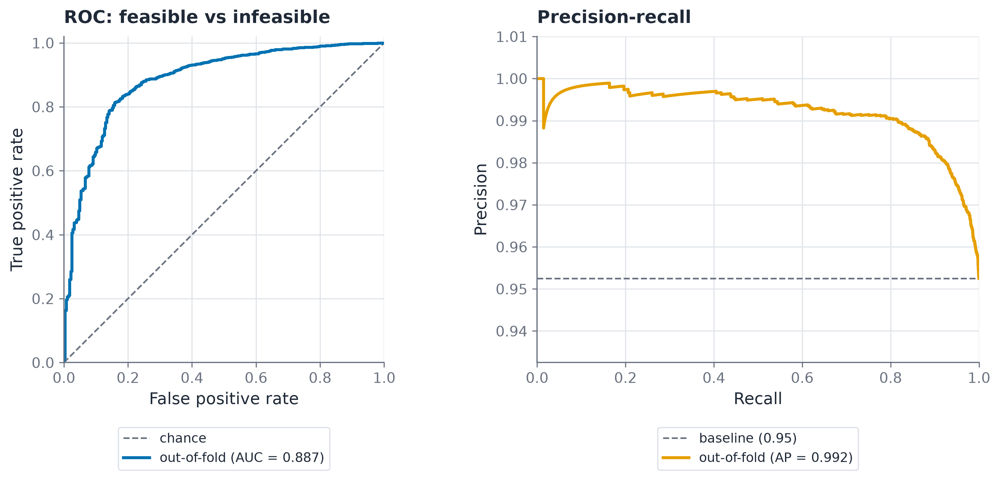
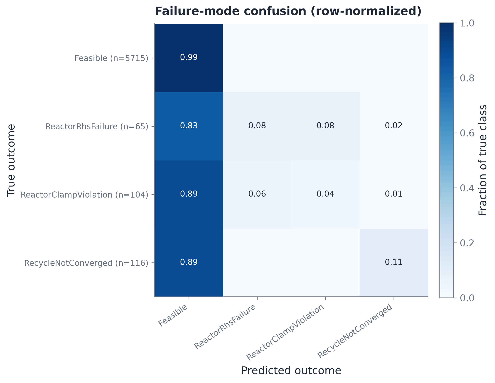
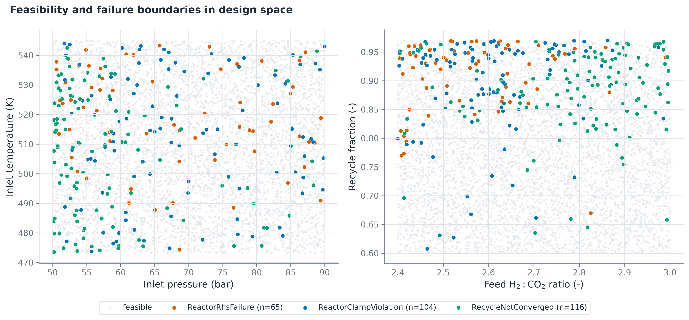

# Feasibility classifier

The feasibility classifier determines whether a candidate design point achieves numerical flowsheet convergence and identifies the corresponding failure mode if convergence fails. Failed evaluations serve as the positive training signal for the failure class.

## 1. Classification structure

1. Binary feasibility: $f = \mathbb{1}[\texttt{ok} \wedge \texttt{feasible} \wedge (\texttt{outcome\_code} = 0)]$. Acts as the operational screening filter to determine whether a design point can be evaluated reliably by the surrogate.
2. Multiclass outcome: $c = \texttt{outcome\_code}$. Identifies which specific physical or numerical constraint caused failure.

Both classification models are trained with LightGBM. The binary model applies isotonic calibration. The multiclass model applies random oversampling to balance minority failure classes across training folds.

## 2. Validation strategy

Validation uses stratified 5-fold cross-validation to preserve class proportions across folds. Metrics are computed out-of-fold. The binary classifier evaluates precision, recall, and F1 on the infeasible class across a sweep of probability thresholds, since overall accuracy is biased by the 95% feasible majority.

## 3. Results on 6000-point dataset

Binary classification performance:

| Decision threshold | Infeasible precision | Infeasible recall | Infeasible F1 |
|---|---|---|---|
| 0.50 (default) | 0.50 | 0.20 | 0.29 |
| 0.93 (tuned) | 0.40 | 0.39 | 0.39 |

The out-of-fold ROC-AUC is 0.89. Figure 10 illustrates the classification performance curves for the binary feasibility model.

Figure 10: Performance curves for binary feasibility classification under 5-fold cross-validation. (Left) Receiver Operating Characteristic (ROC) curve displaying an out-of-fold area under the curve of 0.89 against random chance. (Right) Precision-Recall (PR) curve for the infeasible failure class showing the operational trade-off across decision thresholds. Tuned threshold selection prioritizes failure recall to safeguard downstream optimization routines from selecting unstable operating regimes.

Multiclass performance:
Per-mode recall ranges between 0.04 and 0.11, yielding a macro F1 score of 0.33. Figure 11 displays the multiclass confusion matrix.

Figure 11: Normalized out-of-fold confusion matrix for multiclass failure mode identification across feasible solves and three physical failure mechanisms: RecycleNotConverged, ReactorClampViolation, and ReactorRhsFailure. Feasible points are classified with 99 percent fidelity, while minority failure attribution reflects sparse boundary occurrences.

## 4. Class imbalance and boundary behavior

The performance of multiclass classification is constrained by the small number of failure occurrences in the dataset. At an overall failure rate of 4.5% to 4.8%, individual failure modes contain only 15 to 35 samples per fold.

Widening the input bounds via `--wide` increased the overall failure rate from 4.50% to 4.75%. The C++ twin solver remains stable across wide parameter ranges, and failure points are scattered throughout boundary regions. Resolving specific failure boundaries requires targeted adaptive sampling along solver failure perimeters.

Figure 12 maps the spatial distribution of these failure modes across key two-dimensional slices of the design space.

Figure 12: Feasibility and failure boundary maps across 2D slices of the 11-dimensional design space. Blue circles denote feasible plant runs; colored markers highlight failure modes: RecycleNotConverged (purple squares), ReactorClampViolation (orange circles), and ReactorRhsFailure (red diamonds). Infeasible clusters concentrate near extreme recycle ratios, elevated inlet pressures, and low catalyst activities.
