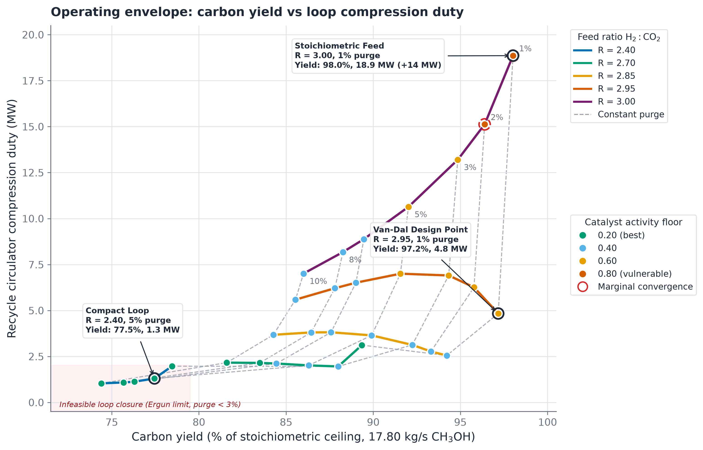

# Operating envelope and recycle dynamics

This document details the chemical engineering principles, governing equations, and operational boundaries displayed in the operating envelope figure.

## 1. Operating envelope overview

Figure 13 presents the complete chemical engineering operating envelope generated from the rigorous C++ flowsheet.



Figure 13: Chemical engineering operating envelope mapping carbon yield against recycle circulator duty across fresh feed molar ratios (R = 2.40 to 3.00) and purge fractions (1 to 10 percent). Red dashed markers denote the Ergun bed pressure drop infeasibility boundary. Callouts highlight landmark operating regimes including the Van-Dal design benchmark (R = 2.95, 2 percent purge) and stoichiometric feed penalty (R = 3.00). Open markers denote catalyst activity floors (a = 0.20 to 0.80).

The operating envelope maps the trade-off between carbon yield and recycle compression duty across two operational degrees of freedom:
1. Fresh feed molar ratio $R = \dot{n}_{\mathrm{H_2}} / \dot{n}_{\mathrm{CO_2}}$ swept across $\{2.40, 2.70, 2.85, 2.95, 3.00\}$.
2. Purge fraction $p$ swept across $\{10\%, 8\%, 7\%, 5\%, 3\%, 2\%, 1\%\}$, corresponding to recycle fraction $1 - p$.

All points represent rigorous converged steady-state solves from the C++ flowsheet model with a sourced 44,500 kg catalyst charge under cooled jacketed reactor operation.

## 2. Chemical reactions and stoichiometry

Methanol synthesis from carbon dioxide involves three reversible reactions over the Cu/ZnO/Al2O3 catalyst:

$\mathrm{CO_2 + 3 H_2 \rightleftharpoons CH_3OH + H_2O}, \quad \Delta H_{298\mathrm{K}}^\circ = -49.5\ \mathrm{kJ/mol}$

$\mathrm{CO_2 + H_2 \rightleftharpoons CO + H_2O}, \quad \Delta H_{298\mathrm{K}}^\circ = +41.2\ \mathrm{kJ/mol}$

$\mathrm{CO + 2 H_2 \rightleftharpoons CH_3OH}, \quad \Delta H_{298\mathrm{K}}^\circ = -90.7\ \mathrm{kJ/mol}$

The stoichiometric number at any stream is defined by:

$$SN = \frac{y_{\mathrm{H_2}} - y_{\mathrm{CO_2}}}{y_{\mathrm{CO}} + y_{\mathrm{CO_2}}}$$

For fresh binary feed without $\mathrm{CO}$, $SN_{\mathrm{fresh}} = R - 1$. An exact stoichiometric mixture requires $R = 3.00$ ($SN_{\mathrm{fresh}} = 2.00$). Sub-stoichiometric feed ($R < 3.00$) leaves $\mathrm{H_2}$ as the limiting reactant.

## 3. Carbon yield and theoretical ceiling

For a fresh feed rate of 88 t/h (24.444 kg/s) of $\mathrm{CO_2}$, complete stoichiometric conversion to methanol defines the ceiling:

$$\dot{m}_{\mathrm{CH_3OH, ceiling}} = \dot{m}_{\mathrm{CO_2}} \frac{M_{\mathrm{CH_3OH}}}{M_{\mathrm{CO_2}}} = 24.444 \times \frac{32.042}{44.01} = 17.80\ \mathrm{kg/s}$$

Carbon yield is evaluated relative to this absolute benchmark:

$$\eta_{\mathrm{C}} = 100 \times \frac{\dot{m}_{\mathrm{CH_3OH}}}{\dot{m}_{\mathrm{CH_3OH, ceiling}}}$$

When $R < 3.00$, hydrogen deficiency caps the maximum achievable carbon yield to $R / 3.0$:
- At $R = 2.40$, the maximum theoretical yield is 80.0%.
- At $R = 2.70$, the maximum theoretical yield is 90.0%.
- At $R = 2.85$, the maximum theoretical yield is 95.0%.
- At $R = 2.95$, the maximum theoretical yield is 98.33%.
- At $R = 3.00$, the ceiling reaches 100.0%.

## 4. Recycle circulator duty and non-monotonic behavior

The recycle gas circulator restores pressure lost across the loop equipment:

$$\Delta P_{\mathrm{loop}} = \Delta P_{\mathrm{bed}} + \Delta P_{\mathrm{hx}} + \Delta P_{\mathrm{flash}}$$

The pressure drop across the packed catalyst bed follows the Ergun equation:

$$\frac{\Delta P_{\mathrm{bed}}}{L} = 150 \frac{(1 - \epsilon)^2}{\epsilon^3} \frac{\mu v_0}{d_p^2} + 1.75 \frac{1 - \epsilon}{\epsilon^3} \frac{\rho v_0^2}{d_p}$$

Compression power depends on the recycled volumetric flow rate $\dot{V}_{\mathrm{rec}}$ and total loop head:

$$\dot{W}_{\mathrm{circ}} \propto \dot{V}_{\mathrm{rec}} \Delta P_{\mathrm{loop}}$$

Because $\Delta P_{\mathrm{bed}}$ scales quadratically with velocity at high flows, circulator duty exhibits steep non-linear growth with recycle volume.

### The inverted knee effect

Across $R = 2.85$ and $R = 2.95$, tightening the purge from 10% to 1% increases carbon yield while lowering circulator duty. Higher single-pass conversion at tight recycle converts gas into condensed liquid products ($\mathrm{CH_3OH}$ and $\mathrm{H_2O}$). Knocking out these liquids in the separator shrinks the remaining gas flow faster than the tighter purge fraction inflates it.

At $R = 3.00$, this balance breaks down. Excess unreacted hydrogen accumulates in the recycle loop because the water-gas shift reaction alters consumption stoichiometry. Volumetric recycle flow expands from 10.4 times fresh feed at 10% purge to 13.8 times fresh feed at 1% purge. Loop compression power surges from 7.01 MW to 18.86 MW.

### Pareto dominance of $R = 2.95$

Comparing $R = 2.95$ and $R = 3.00$ at 1% purge demonstrates Pareto dominance:
- $R = 2.95$ achieves 97.17% carbon yield at 4.84 MW circulator power.
- $R = 3.00$ achieves 98.02% carbon yield at 18.86 MW circulator power.

Gaining 0.85 percentage points of yield at $R = 3.00$ demands an additional 14.02 MW of electrical power, a fourfold increase in compressor power consumption. Operating at $R = 3.00$ is dominated economically.

## 5. Catalyst deactivation and activity floor

Catalyst aging is tested by sweeping relative activity $a \in \{0.80, 0.60, 0.40, 0.20\}$:

$$r_j = a \cdot r_j^\circ$$

The activity floor represents the lowest catalyst activity where the recycle loop equations successfully reach convergence.

Lower catalyst activity reduces per-pass conversion, forcing the flowsheet to recirculate larger gas volumes to sustain production. This increases superficial velocity $v_0$ and Ergun pressure drop.

Operational regimes show contrasting tolerance to deactivation:
- Sub-stoichiometric loops ($R = 2.40, 2.70$) maintain compact recycle loops and converge down to $a = 0.20$.
- Intermediate loops ($R = 2.85, 2.95$) operate reliably down to $a = 0.40$ or $a = 0.60$.
- The stoichiometric loop ($R = 3.00$) at 1% purge requires $a \ge 0.80$. A slight decline in catalyst activity causes loop failure.

## 6. Non-convex feasibility boundary

The feasible operating space is non-convex:
1. Low feed ratio limit ($R = 2.40$): The loop fails to converge at purges below 3% (at 2% and 1%). Carbon dioxide accumulation forces excessive recycle, causing the Ergun pressure drop to exceed total loop head.
2. Isolated failure nodes: At $R = 2.70$, the loop converges at 3% purge and 1% purge, but encounters an integration singularity at 2% purge.
3. Numerical stability limit: Solutions with iteration counts exceeding 40% of the maximum budget (cap fraction > 0.40, marked marginal) exhibit limit cycles across different numerical platforms.

## 7. Key operational regimes

| Regime | Ratio $R$ | Purge $p$ | Carbon yield | Circulator power | Recycle ratio | Activity floor | Operational role |
|---|---|---|---|---|---|---|---|
| Compact Loop | 2.40 | 5.0% | 77.45% | 1.30 MW | 5.01 | 0.20 | Low capital cost, robust to aging |
| Van-Dal Design Point | 2.95 | 1.0% | 97.17% | 4.84 MW | 8.26 | 0.60 | Efficient knee point, high conversion |
| Stoichiometric Feed | 3.00 | 1.0% | 98.02% | 18.86 MW | 13.78 | 0.80 | High power penalty, dominated |

## 8. Generation and reproduction commands

The operating envelope dataset is produced by compiling and running the C++ sweep binary:

```powershell
# Run C++ sweep across ratio and purge grid
./build/operating_envelope.exe > docs/figures/03-operating-envelope.csv
```

To plot the publication figure with matplotlib:

```powershell
# Generate both PNG and SVG figures with clean layout
py -3.12 tools/plot_operating_envelope.py

# Or run from the ML code package with custom tag and wipe option
cd Digital_Twin_ML/code
py -3.12 plot_envelope.py --tag run_1 --wipe
```
