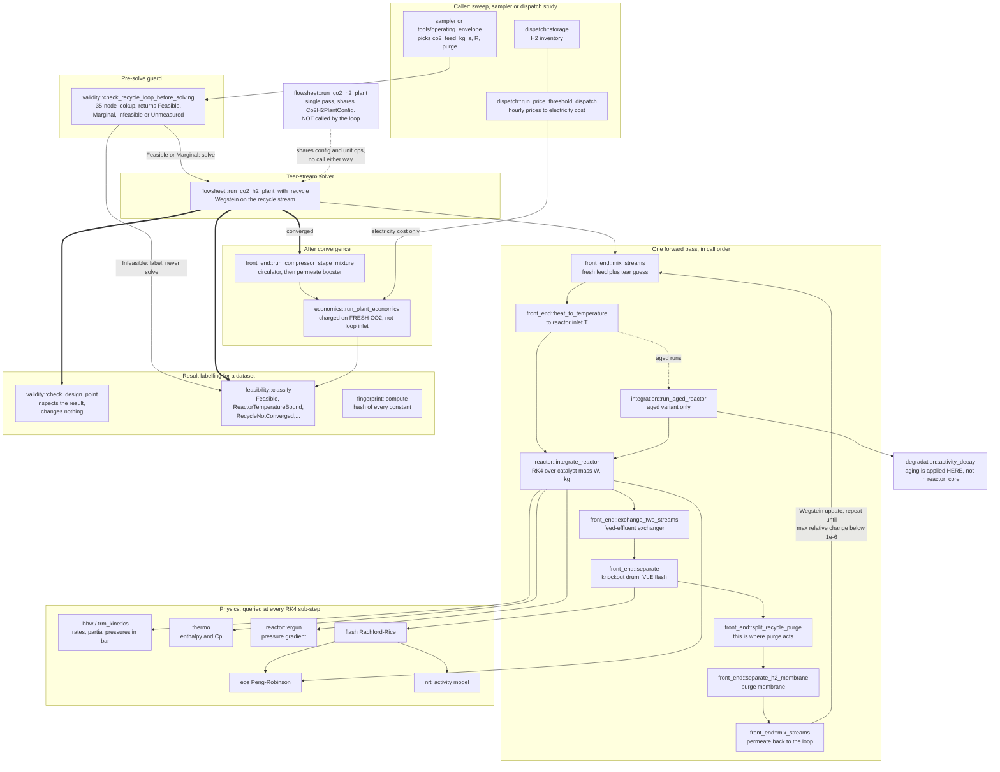

# Flowsheet Composition

How the unit modules are wired into plants, how the recycle loop is solved, and how a single call turns geometry and catalyst activity into a cost per tonne.

## Background: why a flowsheet is harder than its units

Every unit in this project is a function from an inlet stream and a configuration to an outlet stream. Composing them into a once-through process is trivial: call them in order and pass the result along. A recycle loop is not trivial, and the reason is structural rather than numerical.

In a loop, the reactor inlet depends on the recycle stream, and the recycle stream depends on the reactor outlet. The system is implicit. There is no ordering of the unit calls that resolves it, because every ordering contains the same circular dependency.

The standard resolution is to cut the loop at one stream, called the tear stream, guess its value, propagate the guess all the way round, and compare what comes back with what was assumed. That turns a simultaneous system into a fixed-point problem:

$$x_{n+1} = g(x_n)$$

where $x$ is the torn stream and $g$ is one full pass around the flowsheet. This is how commercial sequential-modular simulators work, and it is what is implemented here.

Two properties of $g$ matter. It is expensive, because one evaluation means integrating the reactor over its catalyst mass and solving a multicomponent flash. And it is not a contraction everywhere, so plain iteration can converge slowly or not at all. Both drive the design below.

## The three flowsheet families

Thirteen configurations exist, forming three families that build on each other.

| Family | Entry point | Adds |
|---|---|---|
| Single pass | `co2_h2_plant` | Feed, pre-heat, reactor, knockout |
| Recycle | `co2_h2_plant_recycle` and its purified and aged variants | The tear stream, purge, membrane, circulator, heat integration, distillation, catalyst activity |
| Hybrid | `hybrid_plant` through `hybrid_plant_design_point_full` | Compression train, dispatch, economics, vessel and column sizing |

Each file composes the ones above it rather than editing them. That is a standing rule in this project, and it is why the single-pass module still runs unchanged and still has its own tests, even though nothing in the design point calls it directly.

## Composition over editing

A concrete illustration. The single-pass module contains a line that forces the mixed fresh feed to the reactor's operating pressure without computing any compression work, with a comment saying so. That is correct for a mass and energy balance, which never needed a compressor. What was missing was the cost and power of getting the feeds from their real source pressures, 1 bar for carbon dioxide and 30 bar for hydrogen, up to 78 bar.

The fix was not to edit that line. It was a separate module that applies the existing multi-stage compressor model to the same source and target pressures at the same fresh feed rates, wired in at the economics layer. The reactor chain is untouched and its tests still pin the same numbers.

## Execution flow of one evaluation

The diagram below is the figure. The same text is kept standalone as `figures/04-execution-flow.mermaid` for use in a diagram editor.

Figure 02 is the module layering, which says what may depend on what. This figure is the call order, which is a different question and easy to get wrong by assuming the layering answers it. Four points are worth stating because a reader reconstructing the flow from the layer diagram alone would guess otherwise.

The single-pass flowsheet is not a step inside the loop. `run_co2_h2_plant_with_recycle` does not call `run_co2_h2_plant`. It reuses the same `Co2H2PlantConfig` and the same unit-operation functions and runs the chain itself, because the tear iteration has to interpose between the mixer and the reactor. The two are siblings that share a configuration, not a wrapper and its callee.

Compression happens after convergence, not before the reactor. The feeds are taken as delivered at the reactor inlet pressure, which `co2_h2_plant.hpp` states, so there is no feed compressor in the pass at all. The circulator exists to restore the pressure the Ergun drop consumed, so it is downstream of the drum and runs once on the converged stream.

Aging is applied outside the reactor. `reactor_core` has no knowledge of catalyst activity. `integration/aged_reactor` scales the rate and then calls `integrate_reactor`, so the decay model sits between the flowsheet and the reactor instead of inside it.

Dispatch does not set the feed rates. The dispatch schedule contributes an electricity cost to the economics and nothing else; the carbon dioxide feed is the caller's own design point. This is the decoupling recorded in the limitations, and it is the one edge a reader is most likely to draw when it is not there.

Call sites, so the figure can be checked instead of trusted:

| Step | Call site |
|---|---|
| Pre-solve feasibility lookup | `validity::check_recycle_loop_before_solving` |
| Fresh feed mixed | `co2_h2_plant_recycle.cpp:69` |
| Fresh plus tear guess mixed | `:95` |
| Pre-heat to reactor inlet | `:99` |
| Bed integration | `:113` |
| Feed-effluent exchanger | `:137` |
| Knockout drum | `:173` |
| Recycle and purge split | `:180` |
| Purge membrane | `:189` |
| Permeate returned to the loop | `:193` |
| Circulator, after convergence | `:257` |
| Permeate booster | `:270` |

## The recycle solver

One pass around the loop:

1. Guess a recycle stream. The first iteration guesses zero flow.
2. Mix fresh carbon dioxide, fresh hydrogen and the recycle guess.
3. Heat to the reactor inlet condition, integrate the reactor per tube, scale to plant flow, cool the effluent and flash it in the knockout drum.
4. Split the drum's vapour into recycle and purge.
5. Compare the new recycle stream with the guess. If the largest relative change in any species molar flow is below tolerance, stop. Otherwise apply the Wegstein step and return to 2.

### Wegstein acceleration

Plain successive substitution converges linearly, and closing the pressure loop made it much worse, because the tear stream now couples to the Ergun drop through gas density. Wegstein extrapolates each component from the last two iterates:

$$q = \frac{g_n - g_{n-1}}{x_n - x_{n-1}}, \qquad
x_{n+1} = x_n + \frac{g_n - x_n}{1 - q}$$

This is a secant step on the fixed-point map and is the standard accelerator in commercial flowsheet solvers. It is applied per component, because different species converge at different rates, and it is bounded to $q \in (-5, 0.95)$, because an unbounded step can overshoot into negative flows. The first pass is always plain substitution, since two iterates are needed to form $q$.

The upper bound deserves a note. A monotonically converging loop produces positive $q$, so bounding at zero, which looks like the safe choice, disables the acceleration entirely in exactly the case it is meant to help.

Wegstein is load-bearing here, not a convenience. At the design point the loop runs a recycle eight times the fresh feed, and plain substitution exhausts the 600 pass budget with the residual still two orders of magnitude above tolerance, while Wegstein converges in 115 passes. On the compact-loop branch, at a five times recycle, both routes converge and the classic comparison holds: same fixed point, more passes without acceleration. The test suite asserts both behaviours.

Damping is available and defaults to off, and the reason is that no single setting is right everywhere. Measured against the default of no damping, a relaxation factor of 0.7 nearly halves the passes at the hardest node, 291 down to 165 at the stoichiometric feed and a 1 percent purge, and helps two other nodes. It also makes three worse: the compact branch goes from 111 passes to 306, and $R = 2.70$ at a 3 percent purge from 61 to 125. Tightening the Wegstein bound instead makes every case worse, all of them reaching the iteration cap.

So damping is exposed instead of chosen. 

## The purge

Recycling everything is impossible in a real loop, because something accumulates. Here the fresh feeds are pure, so there is no argon or nitrogen. The role is played by carbon monoxide, produced by the reverse water gas shift but not consumed by the synthesis path modelled, and by surplus hydrogen. A fixed-fraction purge guarantees a bounded steady state for any such species by removing a constant fraction of the loop contents every pass, independent of how the outer iteration behaves.

Worth stating precisely, because it is easy to overclaim: in this model the purge is not strictly necessary. Carbon monoxide is slightly soluble and leaves dissolved in the crude liquid, so a steady state exists at zero purge and the loop converges there. The default takes Van-Dal's stated 1 percent because the paper states it, not because the model demands it. A real plant needs a purge for inert ingress and catalyst poisons that are outside this model's scope.

The purge fraction and the fresh feed ratio cannot be chosen separately. The separations chapter covers that trade in full, including the measured operating envelope. The point relevant here is that the loop's feasibility boundary is a property of the bed hydraulics: mass flux through the fixed tube cross-section grows until the Ergun drop consumes the loop pressure inside a single RK4 sub-step. That boundary is real, it moves with the thermal boundary condition and the feed ratio, and the feasible region it encloses is not convex.

Because it is not convex, the bounds are published as data instead of as a rule. `validity::check_recycle_loop_before_solving` looks a point up in the measured grid and returns feasible, marginal, infeasible or unmeasured, so a sweep can skip a point before paying for a solve, and an off-grid point returns unmeasured instead of an interpolated guess. The provenance chapter sets out what each label means.

## Fresh against reactor-inlet flows

With a recycle loop, carbon dioxide fed to the reactor and carbon dioxide purchased are different numbers. The reactor sees fresh plus recycled material every pass; only the fresh makeup is bought. The result object reports both separately, and economics must charge the fresh figure. Costing the reactor inlet flow would multiply the feedstock bill by the recycle ratio, which at the design point is a factor of eight.

## Per-tube against plant scale

The reactor integrates one tube. Composition inside the bed is per tube, and the boundary conversion is at plant scale. The flowsheet divides the plant molar flows by the tube count on the way in and multiplies the outlet back on the way out.

The tube count itself is derived instead of adopted. Van-Dal publishes a 44,500 kg catalyst charge but no tube geometry; Shi publishes tube diameter and length. Taking Shi's tube count wholesale gave 19,366 kg against Van-Dal's stated charge, undersizing the bed by a factor of 2.3. That error was invisible while loop pressure was forced to a constant, and became obvious once the drum ran at the reactor's real outlet pressure, because the undersized bundle produced a pressure drop of tens of bar and the loop could not close. Deriving the count from the published charge uses one more sourced number and one fewer substitution.

## Heat integration

The feed-effluent exchanger is Van-Dal's own HX4: reactor effluent pre-heats the incoming feed. Because the reactor inlet temperature is a specified design condition, the exchanger does not move the converged compositions, conversions or pressures at all. It only decides how much of the heating and cooling is done against process streams instead of utilities. The test suite asserts that identity to $10^{-12}$, which is what makes the duty comparison meaningful instead of an artifact of a shifted operating point.

Two accounting rules are worth stating. The full cooling load and the trim cooling load are each computed directly, never one from the other by subtraction, because the effectiveness-NTU method works on a mean heat capacity while the condensing cooler integrates the real enthalpy path including condensation, and the two disagree by about a megawatt. Subtracting would attribute that disagreement to the trim cooler.

The recycle also returns cold. It leaves the knockout drum as cold vapour and the circulator's heat of compression is rejected, so it re-enters the mixer near the drum temperature. Handing it back at reactor temperature would collapse the pre-heat duty by an order of magnitude and hide the largest heating load in the flowsheet behind a modelling convenience.

## The design point evaluator

The entry point a sweep or an optimiser is meant to call. Bed geometry and catalyst activity are promoted to top-level fields; everything else has a sourced or flagged default.

One call runs the aged purified recycle loop, the compression train and the dispatch schedule, then feeds the resulting real flows into the economics. No new physics or economics appears at this layer. It is wiring, and every number comes from a function with its own tests.

Catalyst activity is a genuine input instead of a cost line added afterwards. It scales the reaction rate inside the integrator, so it moves conversion, production and unit cost together, and it interacts with the loop: lower activity means less conversion per pass, which means more recycle for the same duty, which means a larger pressure drop. That is why the loop has an activity floor at all, and why the floor differs between operating branches.

The full variant additionally sizes the knockout drum and the distillation column from the converged streams and costs them through the same route everything else uses. It reports the unit cost both with and without them, so the difference the added scope makes is visible instead of buried in a single number.

## Modules

| File | Role |
|---|---|
| `co2_h2_plant` | Single pass: feed, pre-heat, reactor, knockout |
| `co2_h2_plant_recycle` | The tear stream, purge, membrane, circulator, heat integration |
| `co2_h2_plant_recycle_purified` | Adds the let-down flash and the column |
| `co2_h2_plant_recycle_aged` and `..._purified_aged` | The same at reduced catalyst activity |
| `compression_train` | Fresh feed compression from real source pressures |
| `hybrid_plant` | Dispatch plus reactor chain plus economics |
| `hybrid_plant_recycle*` | The same over the recycle loop, in four increments |
| `hybrid_plant_design_point` | One call: geometry and activity in, economics out |
| `hybrid_plant_design_point_full` | Adds vessel and column capital, reports both totals |

## Verification

| Check | Result |
|---|---|
| Loop converges and the residual is below tolerance | 115 passes, $9.4\times10^{-7}$ |
| Wegstein stays well inside the iteration cap | asserted |
| Plain substitution exhausts the cap at the design point | 600 passes, residual $1.6\times10^{-4}$, still descending |
| Plain substitution converges on the compact branch, to the same fixed point | asserted to $10^{-3}$ |
| The exchanger does not move the fixed point | conversion, production and iteration count identical to $10^{-12}$ |
| Carbon closes across the loop boundary | to $5\times10^{-3}$ relative |
| Full and trim cooling duties computed independently | asserted |
| A real pre-heat duty exists | above 40 MW |
| Zero or negative feed refused | asserted |

The carbon balance is the test that would catch a wiring error anywhere in the loop. Fresh carbon in must equal carbon out in the product and the purge, and it closes at the boundary regardless of how many times material goes round.